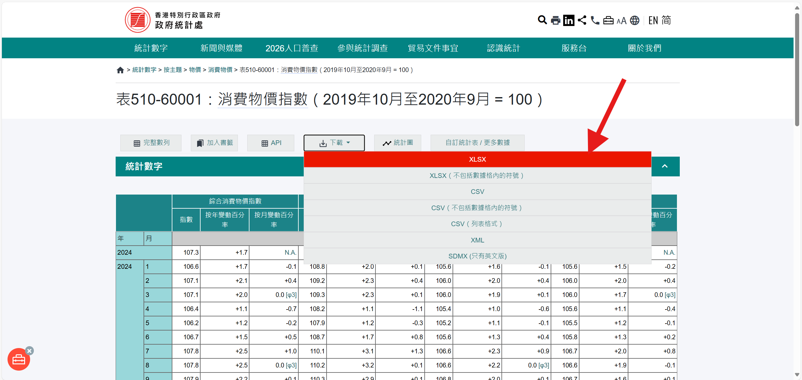
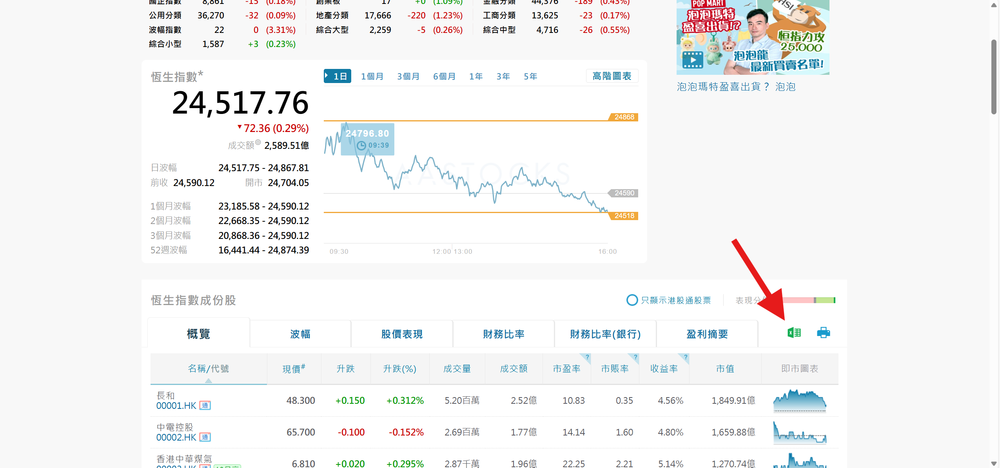
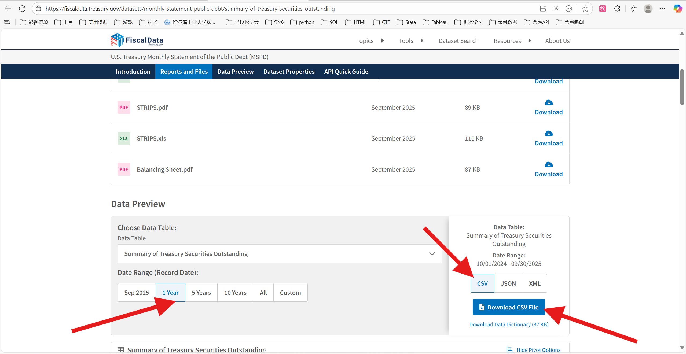
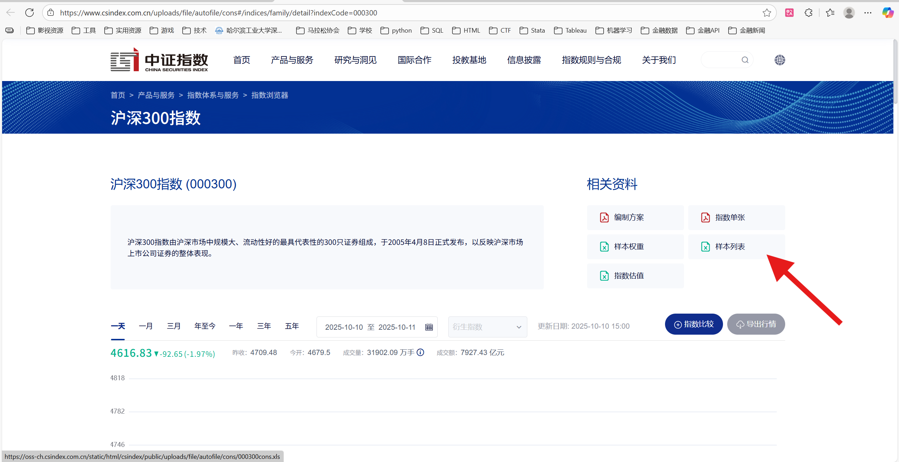
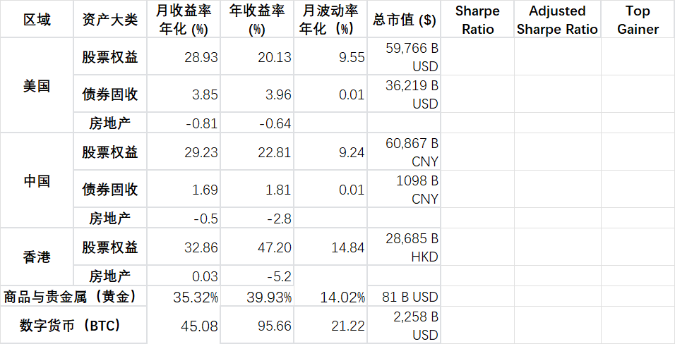

### 一、`asset_mgnt_report`项目概述
- 本项目是《资产管理双周报》的宏观经济和二级市场的数据自动化获取及分析工作流，周报全文可以参考 [资产管理双周报 Wk 2025.10.26-11.8](<assets/资产管理双周报 Wk 20251109 (2025.10.26-11.8) .pdf>)
- 执行`main.py`即可调用各个子脚本，获取CPI、GDP、货币利率、货币利差、股票权益、债券、商品与贵金属、货币汇率等数据，并输出在`output`子文件夹。
- 执行`Gainer.py`，调用四个资产大类的Gainer计算脚本，并输出总结表格在`output`子文件夹。
- 需要单独执行`整体.py`，计算Sharpe Ratio，输出`周报-资产大类表现-整体`表格在`output`子文件夹。
- 执行 `stock_us_cn_hk/market_report_china_hk_2weeks.py`，计算二级市场的股票数据，输出在该子文件夹下。

### 二、前置准备

####  1. 主要通过AKShare、yfinance和FRED等金融数据库自动化获取数据，但是有少量数据需要提前下载至`data`子文件夹：

> 已经设置了文件名正则匹配，更新文件后不需要修改代码

- 香港CPI [政府統計處 : 表510-60001：消費物價指數（2019年10月至2020年9月 = 100）](https://www.censtatd.gov.hk/tc/web_table.html?full_series=1&id=510-60001#)
- - 需要选择“完整数列”，下载长周期的完整数据；同时删去按年计算的CPI，仅保留按月计算的CPI结果

- 恒生指数成分股 [指數及成份股 - 指數成份股 - 恆生指數](http://www.aastocks.com/tc/stocks/market/index/hk-index-con.aspx?index=HSI)

- 美国财政部公布的流通国债总票面价值 [U.S. Treasury Monthly Statement of the Public Debt (MSPD)](https://fiscaldata.treasury.gov/datasets/monthly-statement-public-debt/summary-of-treasury-securities-outstanding) 

- 沪深300成分股名录 [沪深300指数 (000300)](https://www.csindex.com.cn/uploads/file/autofile/cons#/indices/family/detail?indexCode=000300) 

#### 2. “整体”表格

- 2.1 需要提前把各个资产大类的`月收益率年化 (%)``年收益率 (%)``月波动率年化（%）``总市值 ($)`按照`周报-资产大类表现-整体`的形式整理成`*.xlsx`表格，放在`data`子文件夹。

整体表格整理示例 

- 2.2 还需要把`output`文件夹下的汇率表`fx_metrics.xlsx`复制到`整体.xlsx`的sheet2
- 2.3 然后单独执行`整体.py`，计算Sharpe Ratio、 Top Gainer，输出`周报-资产大类表现-整体`表格在`output`子文件夹。

#### 3.FRED_API_KEY
- 有些脚本要从 FRED 获取数据，就要先获取 FRED 的 API Key 并写入环境变量，应当设置的环境变量名称为 `FRED_API_KEY`
- FRED_API 申请网址： [FRED_API_KEYS](https://fredaccount.stlouisfed.org/apikeys)

### 三、文件结构：
- asset_mgnt_report
- - main.py
- - 整体.py
- - Gainer.py
- - requirements.txt ，需要提前安装的 Python 第三方库
- - stock_us_cn_hk文件夹，执行其中脚本，输出结果为周报的 “二级市场”
- - output文件夹，存放输出结果
- - - raw_data文件夹，存放原始数据，便于debug、cross validation
- - data文件夹，存放脚本无法获取、需要手动下载的数据
- - old code文件夹

#### 输出文件说明：
| 指标模块     | 来源脚本                                 | 输出文件名                                                   |
| ------------ | ---------------------------------------- | ------------------------------------------------------------ |
| CPI          | `cpi.py`                                 | `cpi_metrics.xlsx` `cpi_trends.png`                       |
| GDP          | `GDP_new.py`                             | `gdp_metrics.xlsx`                                           |
| 利率         | `interest_rate.py`                       | `interest_rate_metrics.xlsx` `interest_rate_trend_2y.png` |
| 利差         | `carry_trade.py`                         | `currency_spreads.png`                                       |
| 汇率         | `currency.py`                            | `fx_metrics.xlsx`                                            |
| 股票权益     | `asset_stock_index.py` `stock_cap.py` | `stock_weekly_report.xlsx`                                   |
| 债券         | `bonds.py`                               | `bond.xlsx`                                                  |
| 商品与贵金属 | `precious_metals.py`                     | `commodity_indicators_summary.xlsx`                          |
| 整体         | `整体.py`                                | `整体.xlsx`                                                  |

### 四、数据获取及计算方法
#### 1. CPI
| 地区 | 数据类型              | 数据源说明                                                  |
| -- | ----------------- | ------------------------------------------------------ |
| 美国 | 月度 CPI（MoM）       | `akshare.macro_usa_cpi_monthly()`                      |
|    | 年度 CPI（YoY）       | `akshare.macro_usa_cpi_yoy()`                          |
|    | 年度 PCE （YOY)  | `akshare.macro_usa_core_pce_price()`                   |
| | 月度 CPI（MoM） | 近两个月的 YoY 差值近似计算 |
| 中国 | 月度 CPI（MoM）       | `akshare.macro_china_cpi_monthly()`                    |
|    | 年度 CPI（YoY）       | `akshare.macro_china_cpi_yearly()`                     |
| 香港 | 年度&月度 CPI（YoY & MoM） | 本地 Excel 文件：`data/Table 510-60001_sc.xlsx`（经香港政府统计处下载） |

$$
\text{CAGR} = \left( \prod_{i=1}^{n} \left(1 + \frac{r_i}{100} \right) \right)^{\frac{1}{n}} - 1
$$

#### 2. GDP

| 区域 | 数据        | 数据来源                                  |
| ---- | ----------- | ----------------------------------------- |
| 美国 | YoY(%)      | `akshare.macro_usa_gdp_monthly()`         |
|      | 当前季度GDP | `fred.get_series('NGDPSAXDCUSQ')`         |
|      | 当前年化GDP | `FRED API`：`series_id='GDP'`             |
| 中国 | YoY(%)      | `akshare.macro_china_gdp_yearly()`        |
|      | 当前季度GDP | `akshare.macro_china_gdp()`，计算季度差分 |
|      | 当前年化GDP | 最近四个季度 GDP 差分求和                 |
| 香港 | YoY(%)      | `akshare.macro_china_hk_gbp_ratio()`      |
|      | 当前季度GDP | `akshare.macro_china_hk_gbp()`            |
|      | 当前年化GDP | 最近四个季度 GDP 求和                     |

$$
\text{CAGR} = \left( \prod_{i=1}^{n} \left(1 + \frac{r_i}{100} \right) \right)^{\frac{1}{n}} - 1
$$

#### 3. interest rate
| 区域 | 利率久期                 | 数据来源                                  |
| -- | -------------------- | ---------------------------------------- |
| 美国 | US Federal Fund Rate | `akshare.macro_bank_usa_interest_rate()` |
| 中国 | 中国央行LPR 1年           | `akshare.macro_china_lpr()`              |
|    | Chibor 隔夜            | `akshare.rate_interbank()`               |
|    | Chibor 1月            | `akshare.rate_interbank()`               |
| 香港 | HIBOR 隔夜             | `akshare.rate_interbank()`               |
|    | HIBOR 1月             | `akshare.rate_interbank()`               |
|    | HIBOR人民币 1月          | `akshare.rate_interbank()`               |

$$
\text{MoM(%)}
= \left( \frac{r_{\text{now}} - r_{\text{prev}}}{r_{\text{prev}}} \right) \times 100
$$

$$
\text{YoY(\%)} = \left( \frac{r_{\mathrm{now}} - r_{\mathrm{last\_year}}}{r_{\mathrm{last\_year}}} \right) \times 100
$$

- r_prev 设置了前推10天（MOM)或者前推30天（YOY）的容忍期

#### 4. carry_trade 货币利差
$$
\text{CNH - USD} = r_{\text{CNH}} - r_{\text{USD}}
$$

$$
\text{HKD - USD} = r_{\text{HKD}} - r_{\text{USD}}
$$

$$
\text{CNH - HKD} = r_{\text{CNH}} - r_{\text{HKD}}
$$

#### 5. currency 货币利率
| 汇率     | 数据来源                     |
| ------- | -------------------------- |
| USD/CNH | `akshare.forex_hist_em()`  |
| USD/HKD | `akshare.forex_hist_em()`  |
| CNH/HKD | 由 USD/CNH 与 USD/HKD 跨式计算生成 |

MOM、YOY算法与前述基本一致，不再赘述；这里设置了±10天的容忍期

#### 6. 股指市值
| 市场 | 指数名称    | 数据来源                                                        |
| -- | ------- | --------------------------------------------------------------- |
| 美国 | S\&P500 | `akshare.index_stock_cons()`                                    |
| 中国 | 沪深300   | `akshare.index_stock_cons()` + `akshare.stock_a_lg_amount_em()` |
| 香港 | 恒生      | `akshare.stock_hk_index_info()`                                 |
计算方法：所有指数成分股的市值求和

#### 7. 股票权益

| 市场 | 指数名称     | 数据来源                                    |
| -- | -------- | --------------------------------------- |
| 美国 | S\&P 500 | `ak.index_us_stock_sina(symbol=".inx")` |
| 中国 | 沪深300    | `ak.stock_zh_index_daily("sh000300")`   |
| 香港 | 恒生指数     | `ak.stock_hk_index_daily_sina("HSI")`   |

- MOM、YOY计算方法同上，容忍周期分别为±3、±5天
- 年化增长率：
- - 短期（月）：使用算术平均

$$
r_{\text{ann}} = \bar{r}_{\text{daily}} \times 252
$$

- - 中期（半年）及以上：使用几何平均

$$
r_{\text{ann}} = \left( \frac{P_{\text{end}}}{P_{\text{start}}} \right)^{\frac{1}{t}} - 1
$$

- 年化波动率

$$
\sigma_{\text{ann}} = \sigma_{\text{daily}} \times \sqrt{252}
$$

- 夏普比率

$$
\text{Sharpe Ratio} = \frac{r_{\text{ann}} - r_f}{\sigma_{\text{ann}}}
$$

#### 8. 债券

**中国国债**

| 指标类型 | 数据项          | 数据来源                                                  |
| ---- | ------------ | ----------------------------------------------------- |
| 总市值  | 国债托管面值       | `ak.bond_cash_summary_sse(date=...)`（单位：亿元，换算为 B CNY） |
| 交易量  | 记账式国债当日成交金额  | `ak.bond_deal_summary_sse(date=...)`（单位：万元，换算为 B CNY） |
|      | 近30日总成交金额    | `ak.bond_deal_summary_sse()` 按债券类型汇总                  |
| 收益率  | 2年、10年期国债收益率 | `ak.bond_zh_us_rate()`（字段：中国国债收益率2年 / 10年）            |

**美国国债**

| 指标类型 | 数据项          | 数据来源                                                         |
| ---- | ------------ | ------------------------------------------------------------ |
| 总市值  | 国债总额         | `fred.get_series('GFDEBTN')`（单位：百万美元，换算为 B USD）              |
| 收益率  | 2年、10年期国债收益率 | `pandas_datareader.data.DataReader()`，FRED 代码：`DGS2`、`DGS10` |

#### 9. 商品与贵金属

| 标的代码 | 品类    | 数据来源                                           |
| ---- | ----- | ---------------------------------------------- |
| GLD  | 黄金ETF | `yfinance.Ticker("GLD").history(period="6y")`  |
| CL=F | 原油期货  | `yfinance.Ticker("CL=F").history(period="6y")` |
| HG=F | 铜期货   | `yfinance.Ticker("HG=F").history(period="6y")` |

#### 10. 整体
- 收益率
  - 短期-月收益率：近一月的日收益率线性平均，再年化。monthly_return = data['Return'].mean() * 252
  - 中长期-季度及更长时间：复利。
          years = days / 365.25  # 计算周期为几年，如季度收益率，days = 90，years=0.25，0.25年
          return = (1 + total_return)  (1 / years) - 1
- 波动率：std(return) * 252 ** 0.5
- Sharp ratio: ( 年化return - risk free return ) / volatility
  - Risk free return: 当地债券固收的月收益率年化，香港用0.0062
- Adjusted Sharp ratio: ( 年化return + 汇率收益率（YOY) - risk free return ) / volatility
  - Risk free return: 统一使用美国债券固收的月收益率年化
  - 以USD-CHN为例，汇率值为7.1891，YOY为0.0584559284054055%，则从超额收益中扣减0.0584%；但是由于货币MOM一般较小，对sharp ratio的影响也较小
  ”整体“表格中，波动率和 Sharp Ratio 均使用月度数据